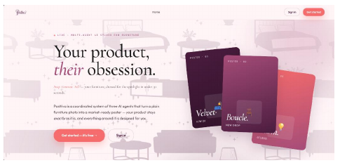
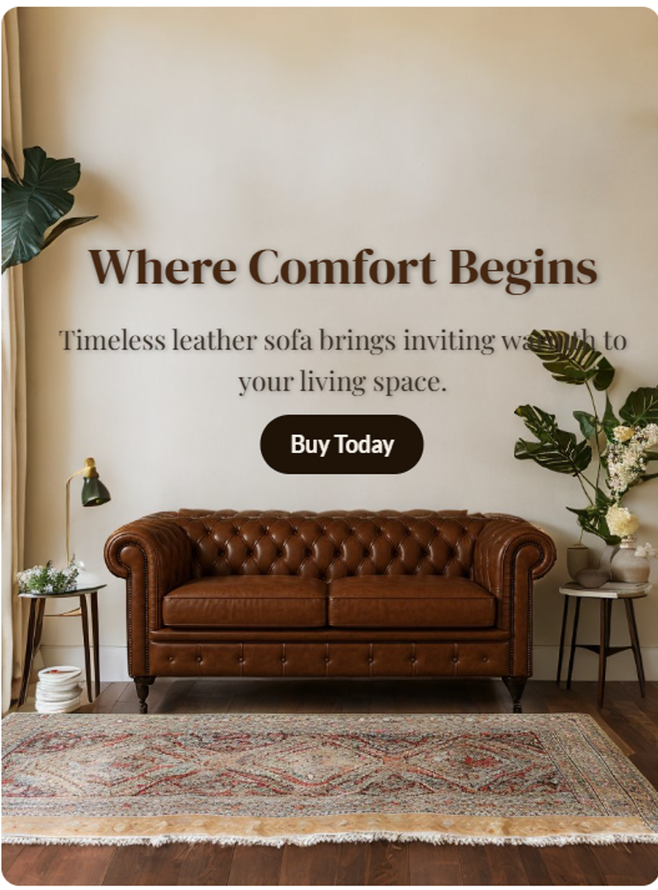
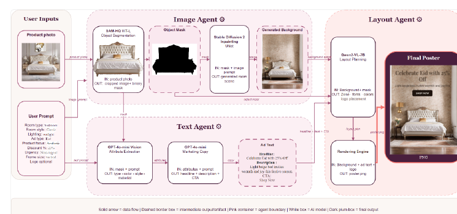

<p align="center">
  
</p>

<h1 align="center">Posttiva</h1>
<p align="center"><strong>Multi-Agent System for Automated Advertisement Poster Generation</strong></p>

Posttiva is an AI-driven advertising assistant that turns a furniture product image and a small set of user preferences into a complete advertisement poster. The system coordinates specialized **Image**, **Text**, and **Layout** agents to preserve the real product, generate a context-aware background, write marketing copy, and compose the final poster.

> **Academic project:** Bachelor of Artificial Intelligence Sciences, College of Computer and Information Sciences, Princess Nourah bint Abdulrahman University (PNU), Riyadh, 2026.

## Demo

<p align="center">
  
</p>

<p align="center">
  
</p>

## System Architecture

<p align="center">
  
</p>

The pipeline is organized into three cooperating agents:

### 1. Image Agent
- **SAM-HQ ViT-L** for human-in-the-loop product segmentation.
- **Stable Diffusion 2 Inpainting** for generating a new interior background around the isolated furniture item.
- Product-preservation and quality checks are used to keep the uploaded item visually unchanged while regenerating the surrounding scene.

### 2. Text Agent
- **GPT-4o-mini Vision** extracts structured product attributes such as type, material, color, and style.
- **GPT-4o-mini** generates a headline, short description, and call-to-action based on both visual attributes and user campaign settings.
- **Claude Sonnet** orchestrates the text workflow and can trigger regeneration when quality requirements are not met.

### 3. Layout Agent
- **Qwen2-VL-7B-Instruct** reasons over the composed image to select text zones, typography, colors, and placement.
- A custom rendering engine creates the final poster while avoiding product/text overlap.
- **CLIP ViT-L/14** scores visual quality and **Claude Opus** performs final poster evaluation/selection.

## Key Results

The final system was evaluated on **50 furniture products**:

| Metric | Result |
|---|---:|
| End-to-end completion | **100% (50/50)** |
| SAM-HQ mean IoU | **86.30%** |
| Background quality acceptance | **100%** |
| Background CLIP score mean | **0.8020** |
| Text Agent acceptance | **100%** |
| Layout quality acceptance | **72%** |
| Mean end-to-end generation time | **87.02 s** |

## User Flow

1. Create an account / sign in.
2. Upload a furniture image and optionally a brand logo.
3. Select the target product interactively with SAM-HQ.
4. Configure the advertisement type, product focus, room, style, lighting, discount/urgency, and poster frame.
5. Generate and approve advertisement text.
6. Generate a product-preserving background.
7. Compose and evaluate the final poster.
8. Customize, save, and download the result.

## Tech Stack

**AI / ML:** Python, PyTorch, Hugging Face Transformers, Diffusers, SAM-HQ, Stable Diffusion 2 Inpainting, GPT-4o-mini, Claude, Qwen2-VL, CLIP, OpenCV, scikit-learn

**Backend:** FastAPI, Express.js, PostgreSQL

**Frontend:** HTML, CSS, JavaScript

## Repository Structure

```text
.
├── Posttiva/                 # Frontend SPA
│   ├── index.html
│   ├── app.js
│   ├── api.js
│   └── config.js
├── Posttiva_Backend/         # FastAPI + AI multi-agent pipeline
│   ├── agents/
│   │   ├── image_agent.py
│   │   ├── text_agent.py
│   │   └── layout_agent.py
│   ├── models/loader.py
│   ├── main.py
│   └── requirements.txt
├── db-server/                # Express/PostgreSQL auth + project persistence
│   ├── server.js
│   ├── db.js
│   ├── schema.sql
│   └── package.json
└── assets/                   # README visuals
```

## Local Setup

### Prerequisites

- Python 3.10+ (3.11 recommended)
- Node.js 18+
- PostgreSQL
- An NVIDIA CUDA-capable GPU is strongly recommended and is required by the current CLIP/layout code path.
- OpenAI and Anthropic API credentials

The first AI run downloads large pretrained model weights, including the SAM-HQ checkpoint and Qwen/Stable Diffusion resources.

### 1. Clone the repository

```bash
git clone <your-repository-url>
cd posttiva
```

### 2. Configure the AI backend

```bash
cd Posttiva_Backend
python -m venv .venv
```

Activate the environment, then install dependencies:

```bash
pip install -r requirements.txt
```

Copy the environment template:

```bash
cp .env.example .env
```

Add your API keys to `.env`, then start FastAPI:

```bash
uvicorn main:app --host 0.0.0.0 --port 8000
```

Health check: `http://localhost:8000/health`

### 3. Configure PostgreSQL and the database server

Create a PostgreSQL database named `posttiva`, then apply the included schema:

```bash
psql -d posttiva -f db-server/schema.sql
```

Install Node dependencies and create the environment file:

```bash
cd db-server
npm install
cp .env.example .env
node server.js
```

The database API runs at `http://localhost:3001` by default.

### 4. Run the frontend

In another terminal:

```bash
cd Posttiva
python -m http.server 8080
```

Open `http://localhost:8080`.

The checked-in `config.js` points to the local AI backend (`:8000`) and database backend (`:3001`). For deployment, replace those values with your hosted endpoints.

## API Overview

### AI backend (FastAPI)

| Method | Endpoint | Purpose |
|---|---|---|
| POST | `/upload` | Upload product image and initialize SAM |
| POST | `/preview` | Generate live SAM selection preview |
| POST | `/save_mask` | Confirm and save selected product mask |
| POST | `/run_text` | Start Text Agent job |
| POST | `/run_image` | Start Image Agent job |
| POST | `/run_layout` | Start Layout Agent job |
| GET | `/job/{job_id}` | Poll agent job status |
| GET | `/job/{job_id}/result` | Fetch completed job result |
| GET | `/health` | Backend health check |

### Database backend (Express)

Provides registration/login, password reset, profile updates, project save/update/delete, feedback, and logout endpoints under `/api/...`.

## Notes

- Model checkpoints, generated images, caches, `.env` files, and `node_modules` are intentionally excluded from Git.
- The current FastAPI implementation keeps AI pipeline state in memory and is designed around the academic/demo workflow rather than multi-user production serving.
- The project is currently focused on furniture advertisements. Future work identified in the study includes additional product categories, multi-product posters, and Arabic/multilingual support.

## Team

Developed as a graduation project by:

- **Reema Saad Alkathiry**
- Layan Hisham Bin Shaheen
- Shouq Khalid Aldossari
- Leen Thabet Khashugji

Supervised by **Prof. Norah Alghamdi**.

### Reema's Contributions

- Image Agent development, including product segmentation and background-generation work.
- AI output evaluation/testing and evaluation-interface work.
- Contributions to frontend integration and the end-to-end project workflow.

## Academic / Portfolio Use

This repository presents the implementation of a university graduation project. Pretrained models and external APIs remain subject to their respective licenses and terms. No separate open-source license is granted by this repository unless the project team adds one explicitly.
